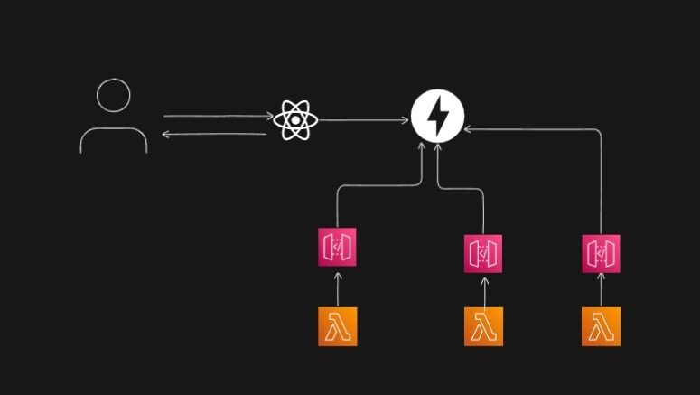

# ITW-project
we created a AI assistant which includes three features email writer,study assistant and poem generator.
SMARTSAGE 
Overview
SMARTSAGE is an AI-powered productivity platform that integrates multiple intelligent assistants into one unified system:
1.	AI Study Assistant – Summarizes notes, generates flashcards, quizzes, and provides explanations for academic content.
2.	AI Email Writer – Composes, rewrites, and tones emails according to context (formal, casual, friendly, etc.).
3.	AI Poems & Quotes Writer – Generates original poems and quotes based on user-defined themes or moods.
The project consists of a FastAPI backend and a React-based frontend that provides a clean, intuitive user interface for interacting with each AI agent.
SMARTSAGE is fully containerized with Docker and uses GitHub Actions for continuous integration, automatically updating the Docker image whenever new changes are pushed.
________________________________________
Architecture
SMARTSAGE follows a modular, service-oriented architecture consisting of:
•	Backend: Built with Python (FastAPI), providing RESTful APIs for AI-powered features.
•	Frontend: Developed using React, allowing users to access the AI assistants via a modern web interface.
•	Services Layer: Handles communication with the OpenAI API and processing of user inputs.
•	Configuration Layer: Manages environment variables, keys, and API settings.
•	CI/CD: Automated pipeline using GitHub Actions for testing, Docker image creation, and deployment updates.
Deployment workflow:
1.	Code is pushed to the main branch.
2.	GitHub Actions run tests and build a new Docker image.
3.	The image is pushed to Docker Hub.
4.	The running container automatically updates with the latest image.

________________________________________
Features
AI Study Assistant
•	Generates multiple-choice quizzes from text.
•	Creates flashcards for study sessions.
•	Explains complex topics in simplified terms.
AI Email Writer
•	Composes professional or casual emails.
•	Rewrites existing drafts for tone or clarity.
•	Supports multiple tones: formal, friendly, persuasive, etc.
AI Poems & Quotes Writer
•	Creates original poems and motivational quotes.
•	Supports themes like love, inspiration, sadness, and friendship.
•	Customizable writing styles (short quotes, rhymed or free verse poems).
________________________________________
Installation
1.	Clone the Repository
2.	git clone https://github.com/yourusername/SMARTSAGE.git
3.	cd SMARTSAGE
4.	Set Up Environment Variables
Create a .env file in the root directory:
5.	OPENAI_API_KEY=your_openai_api_key_here
6.	Run Using Docker
7.	docker build -t smartsage .
8.	docker run -d -p 8000:8000 --env-file .env smartsage
________________________________________
Frontend Setup
The React frontend communicates directly with the FastAPI backend through REST endpoints.
1.	Navigate to the frontend directory:
2.	cd frontend
3.	Install dependencies:
4.	npm install
5.	Start the development server:
6.	npm start
By default, the React app runs on http://localhost:3000 and connects to the backend at http://localhost:8000.
Adjust the base URL in environment variables if needed.
________________________________________
API Endpoints
Category	Endpoint	Method	Description
Study Assistant	/api/study/summarize	POST	Summarize or explain academic text
Study Assistant	/api/study/quiz	POST	Generate quizzes from text
Study Assistant	/api/study/flashcards	POST	Create study flashcards
Email Writer	/api/email/write	POST	Compose an email based on a prompt
Email Writer	/api/email/rewrite	POST	Rewrite an existing email in a new tone
Poems & Quotes	/api/creative/poem	POST	Generate a poem from a theme
Poems & Quotes	/api/creative/quote	POST	Generate quotes by theme or mood
All endpoints return structured JSON responses containing the generated text and metadata.
________________________________________
Usage
After running both backend and frontend:
•	Access the web interface at http://localhost:3000
•	Backend API runs at http://localhost:8000
•	API documentation is available at http://localhost:8000/docs
Example Request:
POST /api/email/write
Body:
{
  "prompt": "Write a polite email to a client apologizing for a delay in delivery."
}
Example Response:
{
  "content": "Dear [Client Name],\n\nI sincerely apologize for the delay in delivering your order..."
}
________________________________________
Deployment Automation
SMARTSAGE is configured for continuous integration and deployment:
•	GitHub Actions automatically test and build Docker images on each commit.
•	Successful builds are pushed to Docker Hub.
•	Production automatically updates with the latest version.
This ensures seamless delivery with minimal manual intervention.
________________________________________
Configuration
Variable	Description
OPENAI_API_KEY	Required – your OpenAI API key
PORT	Optional – defaults to 8000
LOG_LEVEL	Optional – controls verbosity of logs
FRONTEND_URL	Optional – base URL of the React frontend
________________________________________

